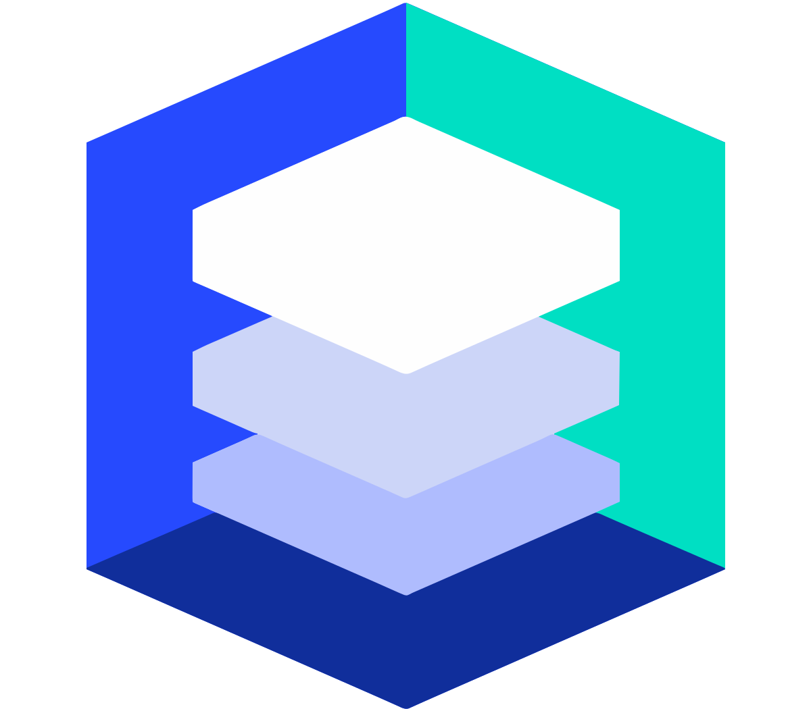

# Akkarapon Phikulsri

**Software Engineer** — Full-stack development, cloud infrastructure, and developer tools.

  

---

## About

I build scalable systems and developer-focused products. My work spans frontend and backend development, cloud deployments, and microservices—with an emphasis on clarity, performance, and maintainability.

---

## Projects

### [DeltaView](https://deltaview.refactorroom.com/) — See the Difference

Developer toolkit for comparing, visualizing, formatting, and analyzing JSON. Built for speed, privacy, and precision.

---

## Links

| | |
|---|---|
| **Portfolio** | [portfolio.refactorroom.com](https://portfolio.refactorroom.com) |
| **Technical writing** | [dev.to/akkaraponph](https://dev.to/akkaraponph) |

---

## Activity

  

  

  <picture>
    <source media="(prefers-color-scheme: dark)" srcset="https://raw.githubusercontent.com/akkaraponph/akkaraponph/main/output/github-snake-dark.svg" />
    <source media="(prefers-color-scheme: light)" srcset="https://raw.githubusercontent.com/akkaraponph/akkaraponph/main/output/github-snake.svg" />
    
  </picture>

---

## Support / Referrals

