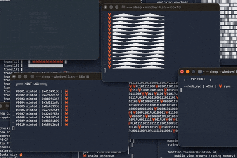

# Akkarapon Phikulsri

**Software Engineer** — Full-stack development, cloud infrastructure, and developer tools.

---

## About

Hi there, I'm Akkarapon Phikulsri, a Software Engineer with end-to-end ownership from requirements discovery and system design to implementation, integration, and production support. I work in Agile environments using Scrum, sprint-based development, and Kanban practices, collaborating closely with business, frontend, and infrastructure teams to turn real-world requirements into practical and maintainable technical solutions.

I specialize in designing reliable and scalable backend systems using Golang, C#, and TypeScript, with hands-on experience in PostgreSQL, SQL Server, Kafka, Redpanda, and workflow orchestration. My experience covers RESTful APIs, GraphQL, WebSocket, gRPC, distributed systems, microservices, and enterprise API integrations. I'm comfortable working with unfamiliar systems and can quickly understand existing architectures, codebases, and business domains to contribute effectively.

Beyond development, I have strong experience supporting production systems, investigating incidents, and analyzing logs, system behavior, integration issues, and data issues. I focus on software craftsmanship, clean architecture, Hexagonal Architecture, maintainability, data correctness, performance, and building systems that remain reliable and stable in production.

---

## Projects

### [DeltaView](https://deltaview.refactorroom.com/) — See the Difference

DeltaView is a fast, privacy-first developer toolkit for comparing, visualizing, formatting, and analyzing JSON. Instantly spot changes, understand complex payloads, and validate data with a clear, focused workflow—without sending your files to a server.

---

## Links

| | |
|---|---|
| **Portfolio** | [portfolio.refactorroom.com](https://portfolio.refactorroom.com) |
| **Technical writing** | [dev.to/akkaraponph](https://dev.to/akkaraponph) |

---

## Activity

  

  

  <picture>
    <source media="(prefers-color-scheme: dark)" srcset="https://raw.githubusercontent.com/akkaraponph/akkaraponph/main/output/github-snake-dark.svg" />
    <source media="(prefers-color-scheme: light)" srcset="https://raw.githubusercontent.com/akkaraponph/akkaraponph/main/output/github-snake.svg" />
    
  </picture>

---

## Support / Referrals

  

