```mermaid
flowchart LR
    A[🎨 Software Craftsmanship] --> B[🎯 Expertise]
    A --> C[🛠️ Tech Stack]
    A --> D[🚀 Projects]
    
    B --> E[⚡ Performance Optimization]
    B --> F[🏗️ Scalable Architecture]
    B --> G[💡 Problem Solving]
    
    C --> H[🎨 Frontend]
    C --> I[⚙️ Backend]
    C --> J[☁️ DevOps]
    C --> K[🗄️ Database]
    
    H --> L[Next.js • Redux • TypeScript]
    I --> M[Golang • C# • Python]
    J --> N[Docker • AWS • Kubernetes]
    K --> O[PostgreSQL • MongoDB • Redis]
    
    D --> P[🌐 Web Applications]
    D --> Q[🔗 Microservices]
    D --> R[📱 Mobile Apps]
    D --> S[🤖 API Development]
    
    E --> T[📊 Monitoring & Analytics]
    F --> U[🔄 CI/CD Pipelines]
    G --> V[🧪 Testing & Quality]
    
    P --> W[💼 Business Solutions]
    Q --> X[🎯 High Availability]
    R --> Y[📱 Cross-Platform]
    S --> Z[🔗 RESTful & GraphQL]

    %% GitHub-optimized styling
    style A fill:#0969da,stroke:#0550ae,stroke-width:4px,color:#ffffff
    
    style B fill:#7c3aed,stroke:#6d28d9,stroke-width:3px,color:#ffffff
    style C fill:#059669,stroke:#047857,stroke-width:3px,color:#ffffff
    style D fill:#f59e0b,stroke:#d97706,stroke-width:3px,color:#ffffff
    
    style E fill:#8b5cf6,stroke:#7c3aed,stroke-width:2px,color:#ffffff
    style F fill:#a855f7,stroke:#9333ea,stroke-width:2px,color:#ffffff
    style G fill:#6366f1,stroke:#4f46e5,stroke-width:2px,color:#ffffff
    
    style H fill:#16a34a,stroke:#15803d,stroke-width:2px,color:#ffffff
    style I fill:#059669,stroke:#047857,stroke-width:2px,color:#ffffff
    style J fill:#0891b2,stroke:#0e7490,stroke-width:2px,color:#ffffff
    style K fill:#0d9488,stroke:#0f766e,stroke-width:2px,color:#ffffff
    
    style L fill:#22c55e,stroke:#16a34a,stroke-width:1px,color:#ffffff
    style M fill:#10b981,stroke:#059669,stroke-width:1px,color:#ffffff
    style N fill:#06b6d4,stroke:#0891b2,stroke-width:1px,color:#ffffff
    style O fill:#14b8a6,stroke:#0d9488,stroke-width:1px,color:#ffffff
    
    style P fill:#f97316,stroke:#ea580c,stroke-width:2px,color:#ffffff
    style Q fill:#f59e0b,stroke:#d97706,stroke-width:2px,color:#ffffff
    style R fill:#eab308,stroke:#ca8a04,stroke-width:2px,color:#ffffff
    style S fill:#d97706,stroke:#b45309,stroke-width:2px,color:#ffffff
    
    style T fill:#c084fc,stroke:#a855f7,stroke-width:1px,color:#ffffff
    style U fill:#d8b4fe,stroke:#c084fc,stroke-width:1px,color:#ffffff
    style V fill:#93c5fd,stroke:#3b82f6,stroke-width:1px,color:#ffffff
    
    style W fill:#fb923c,stroke:#f97316,stroke-width:1px,color:#ffffff
    style X fill:#fbbf24,stroke:#f59e0b,stroke-width:1px,color:#ffffff
    style Y fill:#facc15,stroke:#eab308,stroke-width:1px,color:#ffffff
    style Z fill:#fb7185,stroke:#f43f5e,stroke-width:1px,color:#ffffff
    
    %% Clean link styling
    linkStyle default stroke:#6b7280,stroke-width:2px
```

# Hi there 👋 I'm Akkarapon Phikulsri  
<p align="left">  </p>

## 🧑‍💻 A Software Craftsman

- Passionate about exploring new technologies and building innovative solutions to solve real-world business challenges.
- Skilled across a wide range of areas including frontend and backend development, cloud deployments, and microservices architecture.
- Focused on delivering impactful, scalable, and efficient solutions.

---


<!--START_SECTION:waka-->


**🐱 My GitHub Data** 

> 📦 ? Used in GitHub's Storage 
 > 
> 🏆 2,734 Contributions in the Year 2025
 > 
> 🚫 Not Opted to Hire
 > 
> 📜 142 Public Repositories 
 > 
> 🔑 0 Private Repositories 
 > 
**I'm an Early 🐤** 

```text
🌞 Morning                16432 commits       ███████░░░░░░░░░░░░░░░░░░   29.34 % 
🌆 Daytime                28687 commits       █████████████░░░░░░░░░░░░   51.22 % 
🌃 Evening                10073 commits       ████░░░░░░░░░░░░░░░░░░░░░   17.99 % 
🌙 Night                  814 commits         ░░░░░░░░░░░░░░░░░░░░░░░░░   01.45 % 
```
📅 **I'm Most Productive on Thursday** 

```text
Monday                   9167 commits        ████░░░░░░░░░░░░░░░░░░░░░   16.37 % 
Tuesday                  8988 commits        ████░░░░░░░░░░░░░░░░░░░░░   16.05 % 
Wednesday                9416 commits        ████░░░░░░░░░░░░░░░░░░░░░   16.81 % 
Thursday                 10545 commits       █████░░░░░░░░░░░░░░░░░░░░   18.83 % 
Friday                   9255 commits        ████░░░░░░░░░░░░░░░░░░░░░   16.53 % 
Saturday                 4207 commits        ██░░░░░░░░░░░░░░░░░░░░░░░   07.51 % 
Sunday                   4428 commits        ██░░░░░░░░░░░░░░░░░░░░░░░   07.91 % 
```


📊 **This Week I Spent My Time On** 

```text
🕑︎ Time Zone: Asia/Bangkok

💬 Programming Languages: 
C#                       49 hrs 18 mins      ██████████████████████░░░   86.50 % 
Bash                     5 hrs 2 mins        ██░░░░░░░░░░░░░░░░░░░░░░░   08.84 % 
Other                    1 hr 6 mins         ░░░░░░░░░░░░░░░░░░░░░░░░░   01.95 % 
Go                       45 mins             ░░░░░░░░░░░░░░░░░░░░░░░░░   01.34 % 
Markdown                 26 mins             ░░░░░░░░░░░░░░░░░░░░░░░░░   00.77 % 
```

**Timeline**


 Last Updated on 26/07/2025 14:49:14 UTC
<!--END_SECTION:waka-->


<!--START_SECTION:waka-simple-->

```text
From: 18 August 2021 - To: 26 July 2025

Total Time: 633 hrs 57 mins

C#                                 297 hrs 23 mins ⣿⣿⣿⣿⣿⣿⣿⣿⣿⣿⣿⣶⣀⣀⣀⣀⣀⣀⣀⣀⣀⣀⣀⣀⣀   46.91 %
Python                             44 hrs 7 mins   ⣿⣶⣀⣀⣀⣀⣀⣀⣀⣀⣀⣀⣀⣀⣀⣀⣀⣀⣀⣀⣀⣀⣀⣀⣀   06.96 %
Other                              40 hrs 56 mins  ⣿⣶⣀⣀⣀⣀⣀⣀⣀⣀⣀⣀⣀⣀⣀⣀⣀⣀⣀⣀⣀⣀⣀⣀⣀   06.46 %
```

<!--END_SECTION:waka-simple-->

---

> *"Crafting software requires artistry, guided by imagination, grounded in logic, endlessly enduring."*
> *" - Akkarapon Phikulsri"*

I thrive on challenges, constantly adapt to new technologies, and strive to contribute to impactful software solutions.


<h4 align="center">
Activity
</h4>
  


 <div align="center">

  <div>
    
  </div>
  

  <a href="http://www.github.com/akkaraponph"></a>
  <a href="http://www.github.com/akkaraponph"></a>

</div>


<div>

<h4 align="center">


</div>


<div align="center">


<div style="text-align: center;">
  <picture>
    <source media="(prefers-color-scheme: dark)" srcset="https://github.com/akkaraponph/akkaraponph/blob/output/github-snake-dark.svg" />
    <source media="(prefers-color-scheme: light)" srcset="https://github.com/akkaraponph/akkaraponph/blob/output/github-snake.svg" />
    
  </picture>
</div>
</div>


    
 
 


<br />


 <div align="center">

  </div>

[](https://www.digitalocean.com/?refcode=a351da331073&utm_campaign=Referral_Invite&utm_medium=Referral_Program&utm_source=badge)
<a href="https://www.buymeacoffee.com/akkarapon"></a>


---





